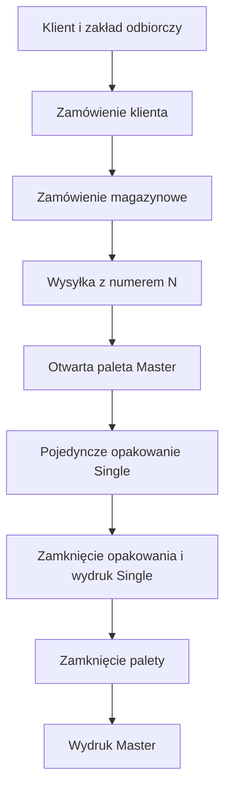

# Plan wdrożenia obsługi etykiet VDA 4902

> Status: propozycja architektoniczna  
> Projekt: `subiekt-mobile`  
> Zakres pierwszej wersji: etykieta VDA 4902 dla pojedynczego opakowania (`Single Pack`) oraz etykieta zbiorcza palety (`Master Pack`).

## 1. Cel

Celem jest rozbudowanie `subiekt-mobile` o proces obsługi dostaw automotive, w którym aplikacja:

1. przechowuje klientów i ich zakłady odbiorcze;
2. przyjmuje zamówienie klienta;
3. przetwarza je na zamówienie magazynowe;
4. tworzy wysyłkę z numerem dokumentu dostawy;
5. prowadzi kompletację do konkretnych opakowań umieszczanych na konkretnej palecie;
6. generuje etykietę VDA 4902 dla każdego zamkniętego opakowania;
7. po zamknięciu palety generuje etykietę Master;
8. zapisuje migawkę danych i audyt każdego wydania etykiety.

Subiekt GT pozostaje systemem źródłowym dla katalogu towarów i ewentualnych dokumentów handlowo-magazynowych. Nie zapisujemy danych roboczych ani konfiguracji VDA bezpośrednio w bazie Subiekta.

## 2. Decyzje projektowe

### 2.1. Numer dokumentu dostawy

Pole VDA oznaczone prefiksem `N` będzie przechowywane jako osobne pole `DeliveryNoteNumber` w encji `Shipment`.

Nie należy umieszczać tego numeru wyłącznie w polu `Uwagi` ani `Podtytuł` dokumentu Subiekta, ponieważ są to dane nieustrukturyzowane i nie zapewniają walidacji, historii ani jednoznacznego użycia na etykiecie.

Jeżeli dokumentem dostawy firmy jest WZ wygenerowane w Subiekcie GT, aplikacja zapisuje numer tego dokumentu w `Shipment.DeliveryNoteNumber`. Jeśli Subiekt nie generuje WZ w tym procesie, numer jest nadawany przez aplikację według ustalonej numeracji. W obu wariantach numer na etykiecie, dokumencie oraz w przyszłym komunikacie EDI/ASN musi być identyczny.

### 2.2. Kiedy drukowana jest etykieta

- Etykieta `Single Pack` jest drukowana po zamknięciu pojedynczego opakowania, gdy znane są: towar, ilość, partia, typ opakowania, masa oraz paleta nadrzędna.
- Etykieta `Master Pack` jest drukowana dopiero po zamknięciu palety. Wtedy znana jest ostateczna liczba opakowań i kompletna zawartość palety.
- Wydruk nie może być wyłącznie „podglądem bieżących danych”. Każde wydanie zapisuje niezmienną migawkę danych etykiety.

### 2.3. Zakres pierwszej wersji

MVP obsługuje tylko opakowanie pojedyncze, które zawiera:

- jeden numer części klienta;
- jedną partię;
- jedną ilość;
- jeden typ opakowania.

Mieszane opakowania oraz palety zawierające różne numery części wymagają osobnej, potwierdzonej specyfikacji odbiorcy. Nie należy ich wdrażać przez automatyczne łączenie istniejących pozycji palety.

## 3. Model procesu



### 3.1. Przebieg operacyjny

1. Administrator tworzy klienta oraz co najmniej jeden jego zakład odbiorczy.
2. Dla zakładu definiuje profil logistyczny: adres, punkt rozładunku, numer dostawcy, domyślne opakowania oraz wymagania etykiet.
3. Użytkownik tworzy zamówienie klienta wraz z pozycjami.
4. Aplikacja tworzy na jego podstawie zamówienie magazynowe. To obecne `Order` w kodzie; na początku nie trzeba od razu zmieniać nazwy klasy.
5. Przed kompletacją użytkownik tworzy wysyłkę oraz przypisuje lub importuje numer dokumentu dostawy `N`.
6. Magazynier tworzy otwartą paletę i wybiera jej typ.
7. Podczas kompletacji wybiera pozycję, paletę oraz tworzy na niej pojedyncze opakowanie.
8. Wprowadza ilość, partię i typ opakowania. Aplikacja sprawdza dostępność ilości oraz wymagania profilu klienta.
9. Magazynier zamyka opakowanie. Aplikacja generuje jego numer seryjny, oblicza masy i pozwala wydrukować etykietę Single.
10. Po spakowaniu wszystkich opakowań użytkownik zamyka paletę, a aplikacja pozwala wydrukować etykietę Master.

## 4. Model domenowy

### 4.1. Docelowa hierarchia

```text
Customer
  └── CustomerSite
        └── CustomerLogisticsProfile

CustomerOrder
  └── CustomerOrderItem
        └── WarehouseOrder (obecne Order)
              └── Shipment
                    └── Pallet (Master)
                          └── HandlingUnit / Package (Single)
                                └── PackageItem
```

### 4.2. Nowe encje

| Encja | Najważniejsze pola | Znaczenie |
|---|---|---|
| `Customer` | `Id`, `Code`, `Name`, `SubiektContractorId?` | Klient handlowy. Opcjonalnie powiązany z kontrahentem Subiekta. |
| `CustomerSite` | `CustomerId`, `Code`, `Name`, `Address`, `CountryCode` | Konkretny zakład lub oddział odbierający towar. |
| `CustomerLogisticsProfile` | `CustomerSiteId`, `SupplierNumber`, `UnloadingPoint`, `DefaultPackagingTypeId`, `LabelProfile` | Konfiguracja wymagana dla danego zakładu. |
| `CustomerPartMapping` | `CustomerSiteId`, `ProductId`, `CustomerPartNumber`, `EngineeringChange?` | Mapowanie towaru Subiekta na numer części klienta. |
| `PackagingType` | `Code`, `Name`, `CustomerPackagingCode`, `TareWeightKg`, `DefaultCapacity?` | Słownik KLT, kartonów, GLT, palet itp. |
| `CustomerOrder` | `CustomerId`, `CustomerOrderNumber`, `CustomerSiteId`, `RequestedDeliveryDate` | Zamówienie otrzymane od klienta. |
| `Shipment` | `WarehouseOrderId`, `CustomerSiteId`, `DeliveryNoteNumber`, `ShipmentDate`, `Status` | Jednostka wysyłkowa; źródło pola `N`. |
| `Pallet` | `ShipmentId`, `PackagingTypeId`, `VdaSerialNumber`, `Status` | Nośnik nadrzędny, czyli Master Pack. |
| `HandlingUnit` | `PalletId`, `PackagingTypeId`, `VdaSerialNumber`, `BatchNumber`, `Status` | Pojedyncze fizyczne opakowanie Single Pack. |
| `HandlingUnitItem` | `HandlingUnitId`, `WarehouseOrderItemId`, `Quantity`, `NetWeightKg` | Zawartość opakowania. MVP: jedna pozycja na opakowanie. |
| `VdaLabelIssue` | `HandlingUnitId?`, `PalletId?`, `Kind`, `SnapshotJson`, `IssuedBy`, `IssuedAtUtc` | Audyt wydruku lub pobrania etykiety. |

### 4.3. Statusy

#### Paleta

```text
Open -> Closed
Open -> Cancelled
```

#### Pojedyncze opakowanie

```text
Draft -> Sealed -> LabelIssued
Draft -> Cancelled
```

Po `Sealed` nie można zmieniać towaru, ilości, partii ani typu opakowania. Korekta wymaga anulowania opakowania oraz utworzenia nowego. Dzięki temu wydrukowana etykieta odpowiada fizycznej zawartości.

## 5. Zmiana obecnego modułu kompletacji i paletyzacji

### 5.1. Stan obecny

Aktualny proces pozwala oznaczyć pozycję jako spakowaną, a następnie wybrać spakowane ilości do palety. Ten model wystarcza do wewnętrznej etykiety palety, ale nie pozwala wskazać, które fizyczne opakowanie otrzymało konkretną etykietę VDA.

### 5.2. Stan docelowy

Dotychczasowe działanie:

```text
pozycja spakowana -> wybór ilości na paletę -> zamknięcie palety
```

Nowe działanie:

```text
pozycja do kompletacji -> wybór palety -> utworzenie opakowania ->
podanie ilości, partii i opakowania -> zamknięcie opakowania -> wydruk Single
```

Paleta nie może już być tworzona wyłącznie z listy spakowanych pozycji. Należy ją utworzyć najpierw jako pustą, otwartą jednostkę Master, a potem przypisywać do niej opakowania pojedyncze.

### 5.3. Obsługa ilości częściowych

Jedna pozycja zamówienia może zostać rozdzielona na wiele opakowań i palet. Przy każdym zamknięciu opakowania aplikacja atomowo zmniejsza ilość dostępną do spakowania.

Przykład:

```text
Pozycja: 100 szt. części A
Paleta P1: opakowanie S1 = 20 szt.
Paleta P1: opakowanie S2 = 20 szt.
Paleta P2: opakowanie S3 = 20 szt.
Pozostaje do spakowania: 40 szt.
```

## 6. Źródła danych

| Dane wymagane na etykiecie | Źródło | Działanie |
|---|---|---|
| Nazwa towaru, symbol, jednostka, masa jednostkowa | Subiekt GT, obecny moduł towarów | Wykorzystać aktualne projekcje i zapisać snapshot na pozycji zamówienia. |
| Kod kreskowy producenta | Subiekt GT | Opcjonalnie wykorzystywać pomocniczo; nie zastępuje numeru części klienta `P`. |
| Klient | Nowa encja `Customer` | Nie opierać procesu wyłącznie na obecnym polu tekstowym `CustomerName`. |
| Zakład odbiorczy i adres | `CustomerSite` | Wybierany podczas tworzenia zamówienia klienta lub wysyłki. |
| Punkt rozładunku | `CustomerLogisticsProfile` lub `Shipment` | Domyślna wartość z profilu, możliwa do korekty dla wysyłki. |
| Numer dokumentu dostawy `N` | `Shipment.DeliveryNoteNumber` | Wprowadzony lub pobrany po utworzeniu dokumentu WZ w Subiekcie. |
| Numer części klienta `P` | `CustomerPartMapping` | Wymagany przed zamknięciem opakowania. |
| Ilość `Q` | `HandlingUnitItem.Quantity` | Zapisana na opakowaniu, nie tylko na pozycji zamówienia. |
| Typ opakowania `B` | `PackagingType` | Pobierany ze słownika oraz profilu klienta. |
| Numer dostawcy `V` | `CustomerLogisticsProfile.SupplierNumber` | Nadany przez klienta. |
| Masa netto i brutto | `HandlingUnit` / `Pallet` | Wyliczona z towaru i tary opakowania. |
| Data | `Shipment.ShipmentDate` | Data wysyłki, nie termin realizacji zamówienia. |
| Numer seryjny `S` / `M` | Generator aplikacji | Unikalny, trwały i przypisany do fizycznej jednostki. |
| Partia `H` | `HandlingUnit.BatchNumber` | Wprowadzana lub skanowana podczas pakowania. |
| Zmiana konstrukcyjna | `CustomerPartMapping.EngineeringChange` | Opcjonalna, zależna od klienta. |

## 7. Dane etykiety i mapowanie VDA

Każdy odbiorca może posiadać własne doprecyzowanie standardu. Dlatego `CustomerLogisticsProfile.LabelProfile` określa pola wymagane, dopuszczalne typy kodów oraz warianty etykiety.

Minimalny zestaw dla profilu VDA 4902:

| Pole | Wartość na etykiecie | Kod kreskowy |
|---|---|---|
| Odbiorca | Nazwa i adres `CustomerSite` | Nie |
| Punkt rozładunku | `UnloadingPoint` | Zależnie od profilu |
| Dokument dostawy | `DeliveryNoteNumber` | `N{numer}` |
| Dostawca | Dane własnej firmy / zakładu | Nie |
| Masa netto | Suma mas towarów | Nie |
| Masa brutto | Masa netto + tara | Nie |
| Liczba opakowań | Liczba `HandlingUnit` w wysyłce lub na palecie | Nie |
| Numer części klienta | `CustomerPartNumber` | `P{numer}` |
| Ilość | Ilość w konkretnym opakowaniu | `Q{ilość}` |
| Opis | Snapshot nazwy towaru | Nie |
| Typ opakowania | Kod klienta dla opakowania | `B{kod}`, gdy wymagany |
| Numer dostawcy | `SupplierNumber` | `V{numer}` |
| Data wysyłki | `ShipmentDate` | Nie |
| Zmiana konstrukcyjna | `EngineeringChange` | Zależnie od profilu |
| Numer jednostki | Numer Single albo Master | `S{numer}` lub `M{numer}` |
| Partia | `BatchNumber` | `H{partia}` |

## 8. Interfejs użytkownika

### 8.1. Administracja

Nowe widoki:

- lista klientów;
- szczegóły klienta;
- zakłady odbiorcze klienta;
- profile logistyczne zakładu;
- mapowania: towar Subiekta -> numer części klienta;
- słownik typów opakowań.

### 8.2. Zamówienie klienta

Formularz zawiera:

- klienta;
- zakład odbiorczy;
- numer zamówienia klienta;
- termin oczekiwanej dostawy;
- pozycje towarowe;
- ilości;
- opcjonalne dane przekazane przez klienta.

### 8.3. Zamówienie magazynowe i wysyłka

Przy utworzeniu zlecenia magazynowego użytkownik potwierdza:

- zakład odbiorczy;
- profil logistyczny;
- datę wysyłki;
- numer dokumentu dostawy `N`;
- kompletność mapowań numerów części klienta.

### 8.4. Ekran pakowania

Ekran powinien prowadzić magazyniera krok po kroku:

1. wybierz lub utwórz paletę;
2. wybierz pozycję towarową;
3. podaj ilość do opakowania;
4. wybierz typ opakowania;
5. podaj lub zeskanuj partię;
6. potwierdź masę tary, jeśli różni się od domyślnej;
7. zamknij opakowanie;
8. drukuj etykietę Single.

Widok palety pokazuje listę opakowań z numerem `S`, towarem, ilością, partią, masą i statusem wydruku.

## 9. API i przypadki użycia

### 9.1. Nowe moduły Application

```text
Customers/
CustomerOrders/
Shipments/
Packaging/
VdaLabels/
```

### 9.2. Przykładowe endpointy

```text
GET    /api/customers
POST   /api/customers
PUT    /api/customers/{customerId}

GET    /api/customers/{customerId}/sites
POST   /api/customers/{customerId}/sites
PUT    /api/customer-sites/{siteId}/logistics-profile

GET    /api/customer-sites/{siteId}/part-mappings
PUT    /api/customer-sites/{siteId}/part-mappings/{productId}

POST   /api/customer-orders
POST   /api/customer-orders/{customerOrderId}/warehouse-orders

POST   /api/warehouse-orders/{orderId}/shipments
PUT    /api/shipments/{shipmentId}/delivery-note

POST   /api/shipments/{shipmentId}/pallets
POST   /api/pallets/{palletId}/handling-units
POST   /api/handling-units/{handlingUnitId}/seal
POST   /api/handling-units/{handlingUnitId}/vda-label-issues
POST   /api/pallets/{palletId}/close
POST   /api/pallets/{palletId}/vda-label-issues
```

### 9.3. Najważniejsze komendy

```text
CreateCustomer
CreateCustomerSite
ConfigureCustomerLogisticsProfile
MapCustomerPart
CreateCustomerOrder
CreateWarehouseOrderFromCustomerOrder
CreateShipment
SetShipmentDeliveryNoteNumber
CreateOpenPallet
CreateHandlingUnit
SealHandlingUnit
IssueSingleVdaLabel
ClosePallet
IssueMasterVdaLabel
```

## 10. Reguły walidacji

### 10.1. Przed utworzeniem wysyłki

- wybrany klient i zakład odbiorczy są aktywne;
- istnieje profil logistyczny zakładu;
- wszystkie pozycje mają mapowanie numeru części klienta, jeżeli profil go wymaga;
- data wysyłki jest określona;
- `DeliveryNoteNumber` jest unikalny w zakresie ustalonej numeracji.

### 10.2. Przed zamknięciem opakowania Single

- opakowanie należy do otwartej palety;
- zawiera dokładnie jedną pozycję towarową w MVP;
- ilość jest dodatnia i nie przekracza ilości pozostałej do spakowania;
- istnieje numer części klienta;
- wybrano typ opakowania;
- istnieje numer partii, gdy wymaga go profil;
- znana jest tara oraz dodatnia masa jednostkowa towaru;
- istnieje `DeliveryNoteNumber`, dane dostawcy i dane zakładu odbiorcy;
- numer seryjny `S` jest unikalny.

### 10.3. Przed zamknięciem palety Master

- paleta zawiera co najmniej jedno zamknięte opakowanie;
- wszystkie opakowania należą do tej samej wysyłki;
- wszystkie dane wymagane przez profil klienta są obecne;
- numer `M` jest unikalny;
- nie ma otwartego opakowania na palecie.

## 11. Generowanie dokumentu

### 11.1. Architektura rendererów

Obecny `PalletLabelPdfRenderer` generuje wewnętrzną etykietę PDF 100 × 150 mm. Nie należy zmieniać go w renderer VDA, ponieważ oba dokumenty mają inne przeznaczenie i rozmiar.

Należy dodać osobne kontrakty:

```csharp
public interface IVda4902LabelRenderer
{
    byte[] RenderSingle(VdaSingleLabelSnapshot snapshot);
    byte[] RenderMaster(VdaMasterLabelSnapshot snapshot);
}
```

Renderer generuje PDF DIN A5 w orientacji poziomej. Dane oraz kod kreskowy są przekazywane wyłącznie ze snapshotu, nie przez ponowne odczytywanie bieżących rekordów towaru lub klienta.

### 11.2. Kody kreskowe

Kodowanie i prefiksy muszą zależeć od profilu odbiorcy. Domyślnie można obsłużyć Code 39, lecz przed użyciem produkcyjnym należy potwierdzić z odbiorcą:

- typ kodu kreskowego;
- wymagane prefiksy;
- długości pól;
- format daty;
- format ilości;
- czy wymagany jest wariant etykiety KLT;
- czy klient oczekuje dodatkowego kodu 2D lub danych EDI.

## 12. Współbieżność, audyt i korekty

- Zamknięcie opakowania musi odbywać się transakcyjnie i z kontrolą wersji pozycji zamówienia.
- Dwie osoby nie mogą równocześnie spakować tej samej pozostałej ilości.
- Każdy wydruk i pobranie dokumentu zapisuje użytkownika, czas, typ etykiety, numer kolejnego wydania oraz snapshot.
- Nie wolno nadpisywać wydanej etykiety. Korekta tworzy anulowanie jednostki oraz nową jednostkę i nową etykietę.
- Reprint jest dozwolony, ale tworzy nowy wpis audytowy wskazujący, że jest to ponowne wydanie.

## 13. Migracja aktualnego rozwiązania

### Etap A — bez psucia bieżącego działania

1. Zachować aktualne `Order`, `Pallet` i prostą etykietę 100 × 150 mm.
2. Dodać klientów, zakłady, profile logistyczne i mapowania numerów części.
3. Dodać `Shipment` oraz pole `DeliveryNoteNumber`.
4. Dodać słownik opakowań.

### Etap B — nowy proces pakowania

1. Rozszerzyć `PalletStatus` o `Open`, `Closed`, `Cancelled`.
2. Wprowadzić `HandlingUnit` oraz `HandlingUnitItem`.
3. Zastąpić tworzenie palety z gotowych pozycji procesem: otwarta paleta -> opakowania -> zamknięta paleta.
4. Pozostawić dotychczasową etykietę palety jako opcję wewnętrzną.

### Etap C — VDA 4902

1. Dodać snapshoty VDA oraz renderer DIN A5.
2. Wdrożyć Single Pack.
3. Wdrożyć Master Pack.
4. Dodać wydruk, pobranie i historię wydań.

### Etap D — integracja z Subiektem i EDI

1. Ustalić, czy WZ ma być tworzona w Subiekcie ręcznie, automatycznie czy wyłącznie odczytywana.
2. Zaimplementować adapter odczytu numeru dokumentu oraz ewentualnego identyfikatora WZ.
3. Dopiero po potwierdzeniu wymagań klienta dodać eksport EDI/ASN.

## 14. Plan implementacji MVP

| Iteracja | Rezultat |
|---|---|
| 1 | Klienci, zakłady, profile logistyczne, typy opakowań i mapowanie numeru części klienta. |
| 2 | `Shipment` z jednoznacznym `DeliveryNoteNumber` oraz powiązanie z obecnym zamówieniem magazynowym. |
| 3 | Otwarte palety i pojedyncze opakowania z partią, ilością oraz masami. |
| 4 | Transakcyjne zamykanie opakowania i ekran drukowania Single Pack. |
| 5 | Renderer VDA 4902 Single Pack, PDF DIN A5 i testy skanowania. |
| 6 | Zamknięcie palety oraz renderer Master Pack. |
| 7 | Integracja WZ/Subiekt i ewentualny eksport EDI/ASN. |

## 15. Kryteria akceptacji MVP

Funkcjonalność jest gotowa do testów operacyjnych, gdy:

- można wybrać klienta i konkretny zakład odbiorczy;
- można skonfigurować dla zakładu numer dostawcy, punkt rozładunku oraz mapowanie numerów części;
- wysyłka ma własny, widoczny i niezmienny numer dokumentu `N`;
- magazynier tworzy paletę przed pakowaniem;
- każda zamknięta paczka ma pojedynczy numer `S`, partię, ilość i przypisaną paletę;
- aplikacja blokuje wydruk, gdy brak wymaganych danych;
- aplikacja generuje PDF Single Pack z danymi pobranymi ze snapshotu;
- po zamknięciu palety można wygenerować Master Pack z numerem `M`;
- każda emisja dokumentu jest audytowana;
- testowy wydruk zostanie zaakceptowany przez konkretnego odbiorcę.

## 16. Pytania do rozstrzygnięcia przed implementacją

1. Czy numer `N` zawsze jest numerem WZ z Subiekta, czy czasem numerem nadanym przez klienta?
2. Czy każdy odbiorca wymaga partii `H`?
3. Czy numer `P` ma być pobierany z symbolu towaru, czy zawsze z osobnego mapowania klienta?
4. Jakie typy opakowań są używane w pierwszym wdrożeniu: KLT, karton, GLT, paleta EUR?
5. Czy jedna paleta może zawierać różne numery części i, jeśli tak, jaki wariant Master Label akceptuje odbiorca?
6. Czy potrzebny jest od razu wydruk bezpośrednio na drukarce termicznej, czy wystarczy generowanie PDF?
7. Czy odbiorca przesyła EDI/ASN albo szczegółowy wzór etykiety do zatwierdzenia?

## 17. Materiały referencyjne

- VDA opublikowało następcę VDA 4902: VDA 4994 Global Transport Label. Jeżeli klient nadal wymaga VDA 4902, jego indywidualna specyfikacja ma pierwszeństwo: <https://www.vda.de/en/news/publications/publication/vda-4994---global-transport-label-v2.0-2023-07--replaces-vda-4902->
- Przykładowa specyfikacja odbiorcy, opisująca pola `N`, `P`, `Q`, `V`, `S`/`M`, `H` oraz etykiety Single i Master: <https://www.benteler.com/fileadmin/user_upload/07-Meta-Navigation/Global-Procurement/BS.SCM.037_Transport_Label_VDA_4902.pdf>

